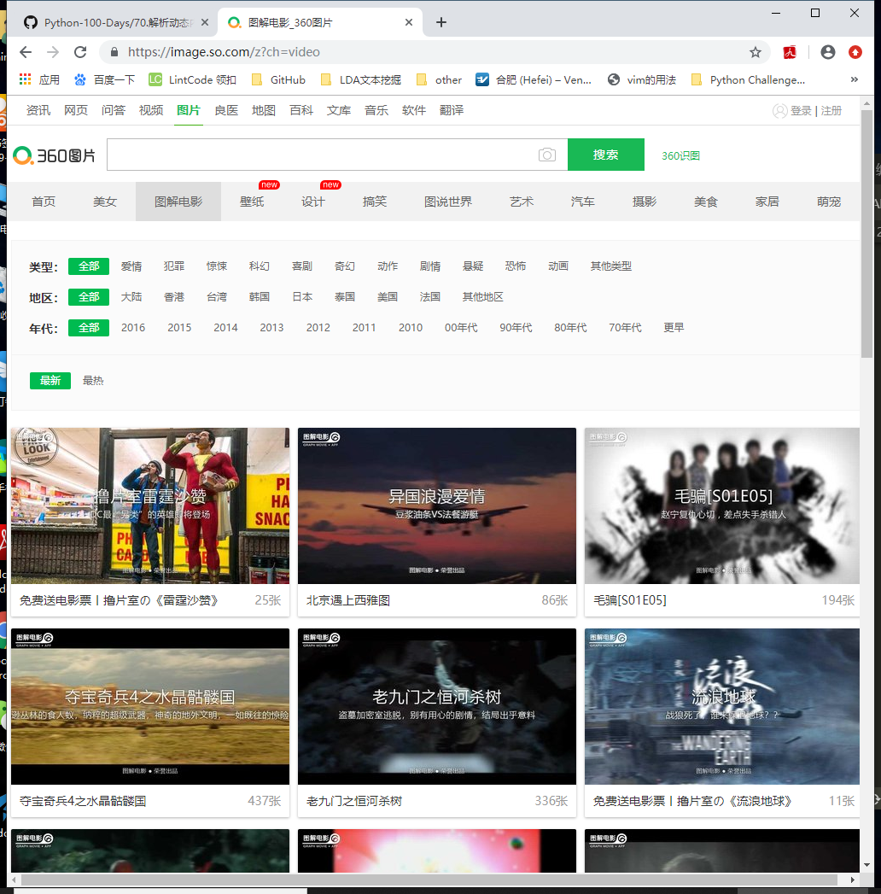

## 解析动态内容

根据权威机构发布的**全球互联网可访问性审计报告**，全球约有**四分之三的网站其内容或部分内容是通过JavaScript动态生成的**，这就意味着在浏览器窗口中“查看网页源代码”时无法在HTML代码中找到这些内容，也就是说我们之前用的抓取数据的方式无法正常运转了。

解决这样的问题基本上有两种方案，**一是JavaScript逆向工程**；**另一种是渲染JavaScript获得渲染后的内容**。

### JavaScript逆向工程
下面以“360图片”网站为例，说明什么是JavaScript逆向工程。

其实所谓的JavaScript逆向工程就是找到通过Ajax技术动态获取数据的接口。

在浏览器中输入https://image.so.com/z?ch=video 就可以打开“360图片”的“图解电影”版块，如下图所示。



但是当我们在浏览器中通过右键菜单“显示网页源代码”的时候，居然惊奇的发现页面的HTML代码中连一个``标签都没有，那么我们看到的图片是怎么显示出来的呢？

原来所有的图片都是通过JavaScript动态加载的，而在浏览器的“开发人员工具”的“网络”中可以找到获取这些图片数据的网络API接口。

那么只要我们找到了这些网络API接口，就能通过这些接口获取到数据，当然**实际开发的时候可能还要对这些接口的参数以及接口返回的数据进行分析，了解每个参数的意义以及返回的JSON数据的格式，这样才能在我们的爬虫中使用这些数据**。

[json数据处理](./1102-day5.md)

### 使用Selenium
> [爬虫学习](https://github.com/2048JiaLi/PY3_privacy/blob/master/%E7%88%AC%E8%99%AB/%E7%BD%91%E7%BB%9C%E7%88%AC%E8%99%AB%E5%85%A5%E9%97%A8%E5%88%B0%E6%94%BE%E5%BC%83/4-3.py)

尽管很多网站对自己的网络API接口进行了保护，增加了获取数据的难度，但是只要经过足够的努力，绝大多数还是可以被逆向工程的，但是在实际开发中，我们可以通过浏览器渲染引擎来避免这些繁琐的工作，WebKit就是一个利用的渲染引擎。

WebKit的代码始于1998年的KHTML项目，当时它是Konqueror浏览器的渲染引擎。2001年，苹果公司从这个项目的代码中衍生出了WebKit并应用于Safari浏览器，早期的Chrome浏览器也使用了该内核。在Python中，我们可以通过Qt框架获得WebKit引擎并使用它来渲染页面获得动态内容

如果没有打算用上面所说的方式来渲染页面并获得动态内容，其实还有一种替代方案就是使用自动化测试工具Selenium，它提供了浏览器自动化的API接口，这样就可以通过操控浏览器来获取动态内容。

> 以“阿里V任务”的“直播服务”为例，来演示如何使用Selenium获取到动态内容并抓取主播图片。

```
import requests
from bs4 import BeautifulSoup

def main():
    resp = requests.get('https://v.taobao.com/v/content/live?catetype=704&from=taonvlang')
    soup = BeautifulSoup(resp.text, 'lxml')
    for img_tag in soup.select('img[src]'):
        print(img_tag.attrs['src'])

if __name__ == '__main__':
    main()
```

运行上面的程序会发现没有任何的输出，因为页面的HTML代码上根本找不到``标签。接下来我们使用Selenium来获取到页面上的动态内容，再提取主播图片。
```
from bs4 import BeautifulSoup
from selenium import webdriver
from selenium.webdriver.common.keys import Keys

def main():
    driver = webdriver.Chrome()
    driver.get('https://v.taobao.com/v/content/live?catetype=704&from=taonvlang')
    soup = BeautifulSoup(driver.page_source, 'lxml')
    for img_tag in soup.body.select('img[src]'):
        print(img_tag.attrs['src'])

if __name__ == '__main__':
    main()
```

在上面的程序中，我们通过Selenium实现对Chrome浏览器的操控，如果要操控其他的浏览器，可以创对应的浏览器对象，例如Firefox、IE等。运行上面的程序，如果看到如下所示的错误提示，那是说明我们还没有将Chrome浏览器的驱动添加到PATH环境变量中，也没有在程序中指定Chrome浏览器驱动所在的位置。
```
selenium.common.exceptions.WebDriverException: Message: 'chromedriver' executable needs to be in PATH. Please see https://sites.google.com/a/chromium.org/chromedriver/home
```

为了解决上面的问题，可以到Selenium的[官方网站](https://selenium.dev/)找到浏览器驱动的下载链接并下载需要的驱动，在Linux或macOS系统下可以通过下面的命令来设置PATH环境变量，Windows下配置环境变量也非常简单，不清楚的可以自行了解。
```
export PATH=$PATH:/Users/Hao/Downloads/Tools/chromedriver/
```
其中`/Users/Hao/Downloads/Tools/chromedriver/` 就是chromedriver所在的路径。

> anaconda环境下可以直接将驱动复制到anaconda目录