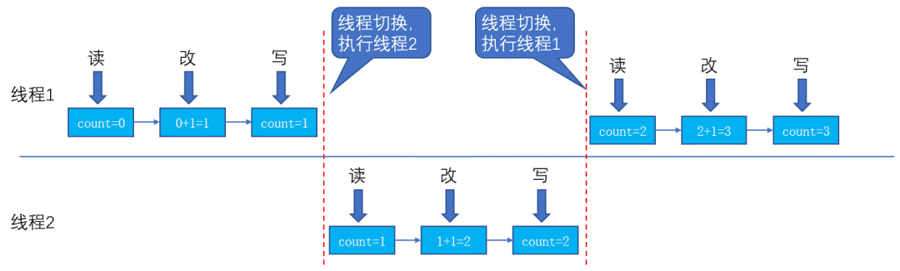

> 原文地址https://mp.weixin.qq.com/s/Rd7fcezGMCqntn3LAc0fFQ

## 为什么会有多线程
显然，线程安全的问题只会出现在多线程环境中，那么为什么会有多线程呢？

最早期的计算机十分原始，还没有操作系统。想要使用计算机时，人们先把计算机可以执行的指令刻在纸带上，然后让计算机从纸带上读取每一条指令，依次执行。这时候的计算机每次只能执行一个任务，是地地道道的单线程。

这种情况下就产生了三个问题:
- 计算资源的严重浪费
  
  计算机在执行任务时，总少不了一些输入输出操作，比如计算结果的打印等。这时候CPU只能等待输入输出的完成。所以往往一个任务执行下来，可能CPU大部分人时间都是空闲的。而在当时CPU可是一种非常昂贵的资源，于是人们就想怎么能够提高CPU的利用率呢？

- 任务分配的不公平

  现在假如我们有十个任务需要执行，这可是很常见的。而计算机每次只能执行一个任务，直到执行结束，中间不能中断。那么问题来了，是先执行张三给的任务呢？还是先干李四的活呢？张三和李四可能拥有同样的优先级，因此无论怎么分配任务总会有人不满意，觉得不公平。

- 程序编写十分困难

  计算机一次只能执行一个任务，所以编写程序的时候往往要把很多工作集成到一个程序中，这给程序的编写人员带来了极大的挑战。能不能把程序分模块编写，然后让模块之间只进行必要的通信呢？

为了解决这些问题，计算机操作系统应运而生。操作系统就是管理计算机硬件与软件资源的计算机程序。

操作系统给每个任务分配一个进程，然后给进程分配相应的计算资源、IO资源等，这样进程就能执行起来了。操作系统会控制多个进程之间的切换，给每个进程分配一定的执行时间，然后再切换另一个进程，这样多个进程便可以轮流着交替执行。因为轮流的时间很短，用户会觉得仿佛在独占计算机资源来执行自己的任务。

进程虽然一定程度上缓解了我们提到的那三个问题，但是还是会存在问题。

- 例1:

  一个例子是进程只能干一件事，或者说进程中的代码是串行执行的。这样是存在问题的。比如我们用软件安装包安装一个程序，安装过程中突然不想安装了，然后点击了取消按钮，结果你发现程序并没有取消安装。这是因为进程正在执行安装程序的代码，用户的输入只有等待安装程序的代码完成之后才能执行。所以你发现等进程响应了你取消安装的输入时，其实安装程序早已执行完成。用专业术语来说，就是用户接口的响应性太差了，用户的输入不能第一时间响应，甚至出现界面假死现象。
  
- 例2：

  另一个例子是现在大部分的处理器是多处理器，比如现在有一个双处理器，而只有一个任务。那么这个任务只能由一个进程来执行，而一个进程只能由一个处理器来执行，那么就有50%的计算资源被浪费了。

所以，引入了线程。**线程是进程中实施调度和分派的基本单位**。一个进程可以有多个线程，但至少有一个线程；而一个线程只能在一个进程的地址空间内活动。内存资源分配给进程，同一个进程的所有线程共享该进程所有资源。而CPU分配给线程，即真正在处理器运行的是线程。多线程的出现便解决了我们之前提到的三个问题，但是多线程往往会带来许多意想不到的问题，这就是接下来我们要说的**线程安全**了。

## 什么是线程安全
一个线程不安全的例子，如下
```java
public class Test {
    private static int count;
    private static class Thread1 extends Thread {
        public void run() {
            for (int i = 0; i < 1000; i++) {
                count ++;
                try {
                    Thread.sleep(1);
                } catch (InterruptedException e) {
                    e.printStackTrace();
                }
            }
        }
    }

    public static void main(String[] args) throws InterruptedException {
        Thread1  t1 = new Thread1();
        Thread1  t2 = new Thread1();
        t1.start();
        t2.start();
        t1.join();
        t2.join();
        System.out.println(count);
    }
}
```
首先定义了一个`int`型的`count`变量，然后开启了两个线程，每个线程执行1000次循环，循环中对`count`进行加1操作。等待两个线程都执行完成后，打印`count`的值。那么这段代码的输出结果是多少呢？可能很多人会说是2000。但是程序运行后却发现结果大概率不是2000，而是一个比2000略小的数，比如1998这样，而且每次运行的结果可能都不相同。

这就是**线程不安全**。**线程安全是指在多线程环境下，程序可以始终执行正确的行为，符合预期的逻辑**。比如我们刚刚的程序，共两个线程，每个线程对`count`变量累加1000次，预期的逻辑是`count`被累加了2000次，而代码执行的结果却不是2000，所以它是线程不安全的。

为什么是不安全的呢？因为`count++`的指令在实际执行的过程中不是原子性的，而是要分为读、改、写三步来进行；即先从内存中读出`count`的值，然后执行`+1`操作，再将结果写回内存中，如下图所示。


<center>线程交替进行</center>

上图就是线程在计算机中真实的执行过程，但是却可能存在问题

.png)
<center>不安全的线程交替执行</center>

上图中线程1执行了两次自加操作，而线程2执行了一次自加操作，但是`count`却从6变成了8，只加了2.我们看一下为什么会出现这种情况。当线程1读取`count`的值为6完成后，此时切换到了线程2执行，线程2同样读取到了`count`的值为6，而后进行改和写操作，`count`的值变为了7；此时线程又切回了线程1，但是线程1中`count`的值依然是线程2修改前的6，
> **这就是问题所在！！！即线程2修改了count的值，但是这种修改对线程1不可见，导致了程序出现了线程不安全的问题，没有符合我们预期的逻辑。**

导致线程不安全的原因总结，主要有三点：
- 原子性：一个或者多个操作在 CPU 执行的过程中被中断

- 可见性：一个线程对共享变量的修改，另外一个线程不能立刻看到

- 有序性：程序执行的顺序没有按照代码的先后顺序执行

针对第三点**有序性**，序执行的顺序会和代码的执行顺序不一致问题。java平台包括两种编译器：静态编译器（javac）和动态编译器（jit:just in time）。静态编译器是将`.java`文件编译成`.class`文件（二进制文件），之后便可以解释执行。动态编译器是将`.class`文件编译成机器码，之后再由jvm运行。**问题一般会出现在动态编译器上，因为动态编译器为了程序的整体性能会对指令进行重排序，虽然重排序可以提升程序的性能，但是重排序之后会导致源代码中指定的内存访问顺序与实际的执行顺序不一样，就会出现线程不安全的问题**。

## 如何保证线程安全
> python的[全局解释器锁(GIL)](https://github.com/2048JiaLi/PY3_privacy/blob/master/Python%E9%9D%A2%E8%AF%95/%E9%A2%98%E7%9B%AE%E4%B8%8E%E7%AD%94%E6%A1%88/python%E4%B8%AD%E7%9A%84GIL.md)

针对以上的三个问题，java程序如何保证线程安全呢？

- **针对问题1**：JDK里面提供了很多`atomic`类，比如`AtomicInteger`, `AtomicLong`, `AtomicBoolean`等等，这些类本身可以通过CAS来保证操作的原子性；另外Java也提供了各种锁机制，来保证锁内的代码块在同一时刻只能有一个线程执行，比如刚刚的例子我们就可以加锁，如下：
```java
synchronized (Test.class){
    count ++;
}
```
  这样，就能够保证一个线程在多`count`值进行读、改、写操作时，其他线程不可对`count`进行操作，从而保证了线程的安全性。

- **针对问题2**：同样可以通过`synchronized`关键字加锁来解决。与此同时，java还提供了一种轻量级的锁，即`volatile`关键字，要优于`synchronized`的性能，同样可以保证修改对其他线程的可见性。`volatile`一般用于对变量的写操作不依赖于当前值的场景中，比如状态标记量等。

- **针对问题3**：可以通过`synchronized`关键字定义同步代码块或者同步方法保障有序性，另外也可以通过Lock接口保障有序性。